<h1>Capstone Student Commute 2023</h1>
<body class="c2 doc-content">

Team Leader: Nicholas Hughes 

Team Members: Franklin Muhuni, Matthew Denniston, Anoje Janathanan 

<h1 class="c6 c25 c16" id="h.uyo7sfip139m">Table of Contents:</h1>

<a class="c3" href="#h.l6nbmjm2qpol">1.0 Download Files</a>

<a class="c3" href="#h.w1eobegdrgng">2.0 Setup Postgres</a>

&nbsp;&nbsp;&nbsp;&nbsp;<a class="c3" href="#h.9fg7lmk175xq">2.1 Download Postgres</a>

&nbsp;&nbsp;&nbsp;&nbsp;<a class="c3" href="#h.aayowd3gp563">2.2 Install Postgres</a>

&nbsp;&nbsp;&nbsp;&nbsp;<a class="c3" href="#h.wxjt4sb70thd">2.3 Create Database</a>

<a class="c3" href="#h.yojc0vkseelo">3.0 Get Google Maps Platform API Key</a>

<a class="c3" href="#h.xl4fqasygxuk">4.0 ParseExcel v2.py</a>

&nbsp;&nbsp;&nbsp;&nbsp;<a class="c3" href="#h.718dq5ioziam">4.1 Installing Dependances</a>

&nbsp;&nbsp;&nbsp;&nbsp;<a class="c3" href="#h.qcbt074i9ue9">4.2 Running the Script</a>

<a class="c3" href="#h.i1lrcu1nionc">5.0 Student Commute v2.py</a>

&nbsp;&nbsp;&nbsp;&nbsp;<a class="c3" href="#h.7jr2xt9xmz5z">5.1 Installing Dependances</a>

&nbsp;&nbsp;&nbsp;&nbsp;<a class="c3" href="#h.ihtb49y41pyy">5.2 Setup Postgres</a>

&nbsp;&nbsp;&nbsp;&nbsp;<a class="c3" href="#h.qb7laa4qej39">5.3 Get Google Maps Platform API Key</a>

&nbsp;&nbsp;&nbsp;&nbsp;<a class="c3" href="#h.erixxmifdtp7">5.4 Get UTC Echo Time</a>

&nbsp;&nbsp;&nbsp;&nbsp;<a class="c3" href="#h.qmodrwlfrkq7">5.5 Running the Script</a>

<a class="c3" href="#h.r223hc1t2jao">6.0 Queries v2.py</a>

&nbsp;&nbsp;&nbsp;&nbsp;<a class="c3" href="#h.87jtaph7737a">6.1 Installing Dependances</a>

&nbsp;&nbsp;&nbsp;&nbsp;<a class="c3" href="#h.txw3q14v6al4">6.2 Running the Script</a>

<a class="c3" href="#h.b6m88bvtzay">7.0 Manually Query From The Database</a>

&nbsp;&nbsp;&nbsp;&nbsp;<a class="c3" href="#h.4y45y4y45h4g">7.1 Open pgAdmin 4</a>

&nbsp;&nbsp;&nbsp;&nbsp;<a class="c3" href="#h.467yfdhg65hh">7.2 Connect to Program</a>

&nbsp;&nbsp;&nbsp;&nbsp;<a class="c3" href="#h.8978i87ik87k">7.3 Connect to Server</a>

&nbsp;&nbsp;&nbsp;&nbsp;<a class="c3" href="#h.87o0pyhjjfgh">7.4 Connect to Database</a>

&nbsp;&nbsp;&nbsp;&nbsp;<a class="c3" href="#h.67jhgjghj76v">7.5 Query</a>

<a class="c3" href="#h.iou3n6t8k5bz">8.0 Heatmaps v2.ipynb</a>

&nbsp;&nbsp;&nbsp;&nbsp;<a class="c3" href="#h.3f345gg45yht">8.1 Upload Notebook</a>

&nbsp;&nbsp;&nbsp;&nbsp;<a class="c3" href="#h.i0ritiqm0h8p">8.2 Running the Notebook</a>

<a class="c3" href="#h.h0unzue9h6sr">9.0 Create Graphs</a>

<h1 class="c6 c16 c25" id="h.slvyhgheush3"></h1><h1 class="c6 c16" id="h.l6nbmjm2qpol">1.0 Download Files</h1>

Download the code from the "code" folder above.

<h1 class="c6 c16" id="h.w1eobegdrgng">2.0 Setup Postgres</h1>
<h2 class="c6 c16" id="h.9fg7lmk175xq">2.1 Download Postgres</h2>

The link to the full tutorial is <a class="c3" href="https://www.google.com/url?q=https://www.youtube.com/watch?v%3D0n41UTkOBb0&amp;sa=D&amp;source=editors&amp;ust=1680720448560190&amp;usg=AOvVaw0GPMEp6ztnWPJjqLBwujVJ">here</a> by 
Geeky Script

Before you can run the scripts you need to download and install the postgres database. Click the download like <a class="c3" href="https://www.google.com/url?q=https://www.enterprisedb.com/downloads/postgres-postgresql-downloads&amp;sa=D&amp;source=editors&amp;ust=1680720448560876&amp;usg=AOvVaw2LW8TCMD8qNw5F3aptwrjY">here</a>. Once there click the download for PostgreSQL Version 15.2. See image below:

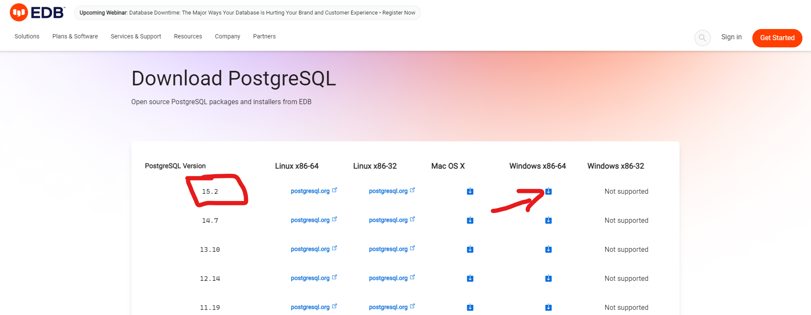

<h2 class="c6 c16" id="h.aayowd3gp563">2.2 Install Postgres</h2>
Once done downloading you can now run the installer. Click next &gt; next &gt; next &gt; next. Then enter a password for the superuser for the database. Remember this password as it will be used later on.&nbsp;After entering your password click next &gt; next &gt; next &gt; next &gt; next. After that it should start downloading. After it&#39;s done click finish &gt; cancel &gt; yes.

<h2 class="c6 c16" id="h.wxjt4sb70thd">2.3 Create Database</h2>
Once done installing you can now <a class="c3" href="#h.b6m88bvtzay">open pgAdmin 4</a>&nbsp;(for more information see <a class="c3" href="#h.b6m88bvtzay">Step 7.0</a>). Click search &gt; then type &ldquo;pgAdmin 4&rdquo; &gt; type in your password from the previous step &gt; click Server &gt; type in your password from the previous step. Now right click database &gt; Create &gt; Database&hellip; See image below: 

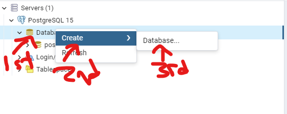

Then enter a name and click save. See image below:

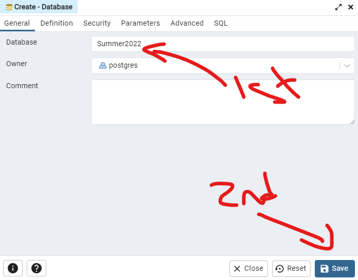

Now you can close the program.

<h1 class="c6 c16" id="h.yojc0vkseelo">3.0 Get Google Maps Platform API Key</h1>

Before we can run the scripts we first need to get the API key from <a class="c3" href="https://www.google.com/url?q=https://mapsplatform.google.com/&amp;sa=D&amp;source=editors&amp;ust=1680720448565314&amp;usg=AOvVaw2_YF6Vp2ZmnP3juhCsG2zf">Google Maps Platform</a>. The link is <a class="c3" href="https://www.google.com/url?q=https://mapsplatform.google.com/&amp;sa=D&amp;source=editors&amp;ust=1680720448565807&amp;usg=AOvVaw2z0S6DZpGJmRSPwm36XPbg">here</a>. After you have loaded up the webpage click &ldquo;Get Started&rdquo;: 

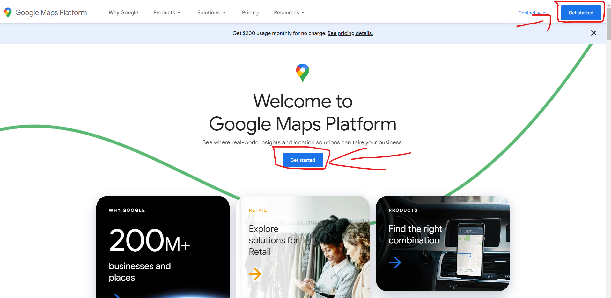

After Sign in to your Google Account you might be automatically redirected to create a project, if not click the following &ldquo;My First Project&rdquo;, then &ldquo;New Project&rdquo; in the top right in the popup. Look at the screenshot below for more details:

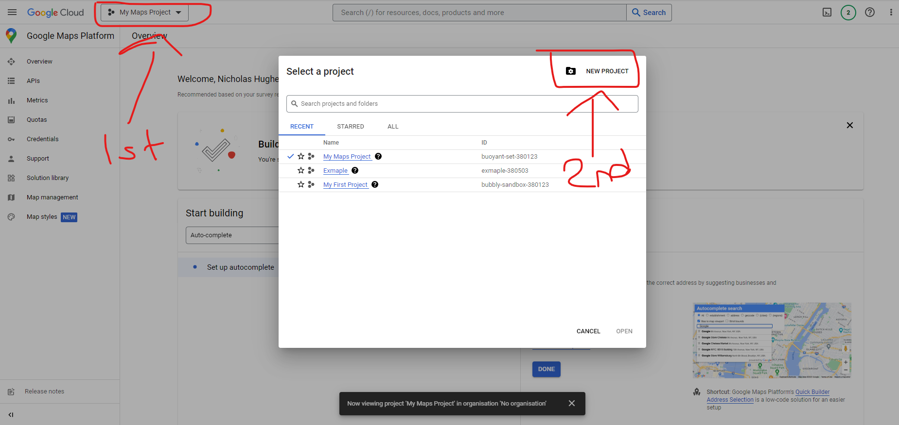

After you filled in your project details, click on &ldquo;API&rdquo;:

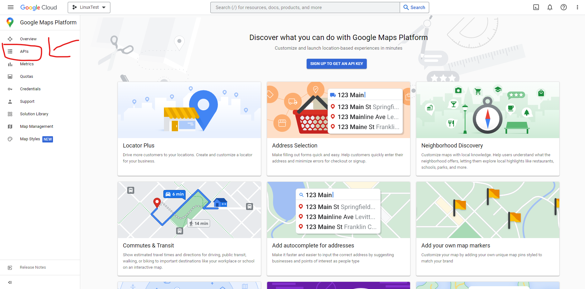

After that fill in your account/billing details, then you should be presented with an API key, like the following:

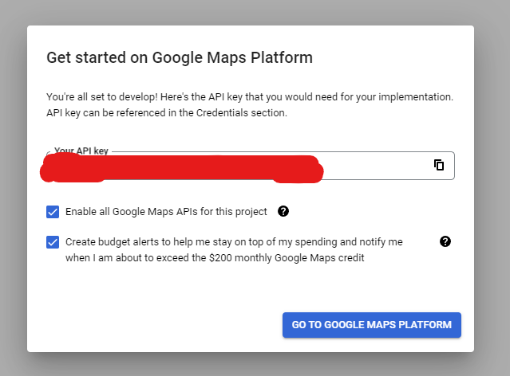

Copy this api key down because we will need it for the scripts.

** <b>Each api key is good for $400 free [as of 03/12/2023] then you pay for the rest</b> **

**** <b>This project requires ONE api keys PER DATASET</b>&nbsp;****
<h1 class="c6 c16" id="h.xl4fqasygxuk">4.0 ParseExcel v2.py</h1><h2 class="c6 c16" id="h.718dq5ioziam">4.1 Installing Dependances</h2>
Before you can use this script you have to install the correct dependencies. Try using the command below:

pip install -r requirements.txt

<h2 class="c6 c16" id="h.qcbt074i9ue9">4.2 Running the Script</h2>
After installing the dependencies you can now run the script. Run the script in the command prompt in the directory where the file are stored:

python &ldquo;ParseExcel v2.py&rdquo;

After this the program will ask for the following inputs, input filename of the excel file, sheet name in the input excel file, the output filename for the newly parsed excel file, and finally the password for the original excel file. See example below:

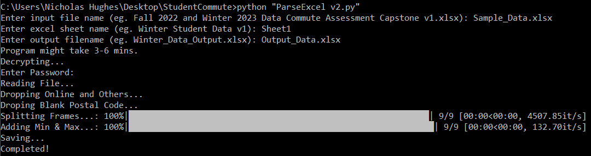

After approximately 3-6 minutes the newly generated excel file should be done. It removes all unnecessary data such as, off campus students, online students and null postal codes. This script also fixes the postal codes to make sure they are in the following format: A1A 1A1.

The script also takes the lowest and highest time for each day and ensures that there is only one day entry for each day. The following are the only categories left after the data has been parsed: 
<ol class="c29 lst-kix_3r5pza5o9d5-0 start" start="1"><li class="c8 c24 li-bullet-0">Unique ID</li><li class="c8 c24 li-bullet-0">Postal Code</li><li class="c8 c24 li-bullet-0">Day</li><li class="c8 c24 li-bullet-0">Begin Time</li><li class="c8 c24 li-bullet-0">Section Campus Code.</li></ol>

<h1 class="c6 c16" id="h.i1lrcu1nionc">5.0 Student Commute v2.py</h1><h2 class="c6 c16" id="h.7jr2xt9xmz5z">5.1 Installing Dependances</h2>
** If you did this in the previous step, skip this step!&nbsp;**

Before you can use this script you have to install the correct dependencies. Try using the command below:

pip install -r requirements.txt

<h2 class="c6 c16" id="h.ihtb49y41pyy">5.2 Setup Postgres</h2>
Before you can use this script you have to have postgres installed and set up. Follow <a class="c3" href="#h.w1eobegdrgng">Step 2.0</a>&nbsp;to get this key. Click <a class="c3" href="#h.w1eobegdrgng">here</a>&nbsp;to go to Step 2.0.

<h2 class="c6 c16" id="h.qb7laa4qej39">5.3 Get Google Maps Platform API Key</h2>
Before you can use this script you have the Google Maps API key. Follow <a class="c3" href="#h.yojc0vkseelo">Step 3.0</a>&nbsp;to get this key. Click <a class="c3" href="#h.yojc0vkseelo">here</a>&nbsp;to go to Step 3.0.

<h2 class="c6 c16" id="h.erixxmifdtp7">5.4 Get UTC Echo Time</h2>
Before you can use this script you need to have the current date next week&#39;s Sunday at Midnight echo time (in seconds). Go to this <a class="c3" href="https://www.google.com/url?q=https://www.timeanddate.com/date/timezoneduration.html?d1%3D1%26m1%3D1%26y1%3D1970%26d2%3D02%26m2%3D07%26y2%3D2023%26h1%3D0%26i1%3D0%26s1%3D0%26h2%3D0%26i2%3D0%26s2%3D0%26&amp;sa=D&amp;source=editors&amp;ust=1680720448575818&amp;usg=AOvVaw0i3XA7zhLX4txQJB2DVLur">link</a>&nbsp;to find the time in seconds. See the example below: 

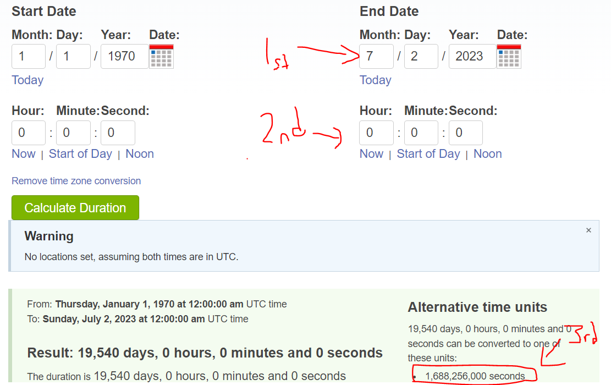

<h2 class="c6 c16" id="h.qmodrwlfrkq7">5.5 Running the Script</h2>
After you have the dependencies, postgres database installed, Google Maps API key, and the UTC echo time, you can now run the script. Run the script in the command prompt in the directory where the file are stored:

python &ldquo;StudentCommute v2.py&rdquo;

See example below:

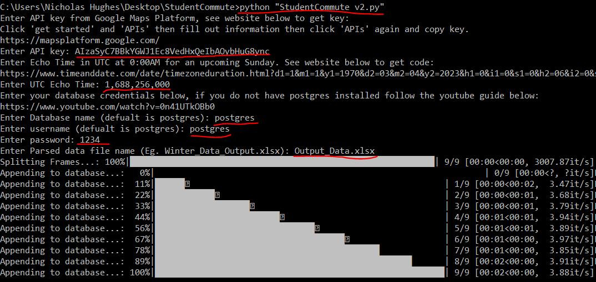

<h1 class="c6 c16" id="h.r223hc1t2jao">6.0 Queries</h1><h2 class="c6 c16" id="h.87jtaph7737a">6.1 Installing Dependances</h2>
** If you did this in the previous step, skip this step!&nbsp;**

Before you can use this script you have to install the correct dependencies. Try using the command below:

pip install -r requirements.txt

<h2 class="c6 c16" id="h.txw3q14v6al4">6.2 Running the Scripts</h2>
After you have the dependencies and the postgres database installed you can now run the scripts. Run the scripts in the command prompt in the directory where the file are stored:

python &ldquo;Queries_v2.py&rdquo; and &nbsp; python &ldquo;Queries_v3.py&rdquo;

python &ldquo;Queries_v4.py&rdquo; and &nbsp; python &ldquo;Queries_v5.py&rdquo;

See example below:

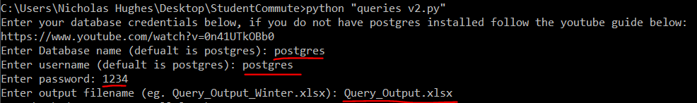

<h1 class="c6 c16" id="h.b6m88bvtzay">7.0 Manually Query From The Database</h1>
  
<h2 class="c6" id="h.4y45y4y45h4g">7.1 Open pgAdmin 4</h2>

Click your search bar in the bottom left of your screen. And type &ldquo;pgAdmin 4&rdquo; and click enter. See results below:

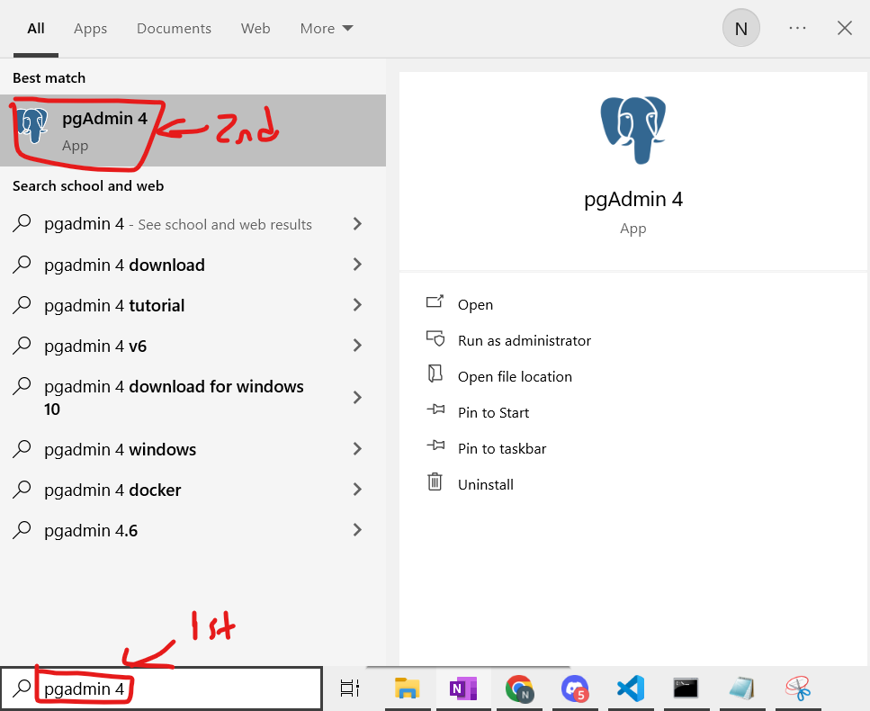

  
<h2 class="c6" id="h.467yfdhg65hh">7.2 Connect to Program</h2>

Once the program loads enter your password from the step up earlier in <a class="c3" href="#h.w1eobegdrgng">step 2.0</a>. See results below:

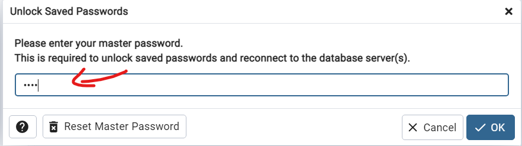

<h2 class="c6" id="h.8978i87ik87k">7.3 Connect to Server</h2>

Once you have entered your password, click on the &ldquo;Servers (1)&rdquo; icon on the far left. Then enter your password from the step up earlier in <a class="c3" href="#h.w1eobegdrgng">step 2.0</a>. See results below:

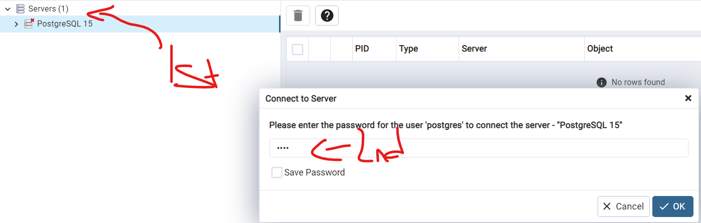

<h2 class="c6" id="h.87o0pyhjjfgh">7.4 Connect to Database</h2>

Once you have entered your password, click on the database you saved your data to, and click connect. See results below:

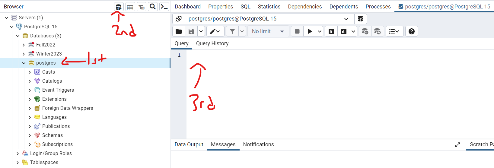

<h2 class="c6" id="h.67jhgjghj76v">7.5 Query</h2>

Once you have connected to the database now you can query it all you want. See results below:

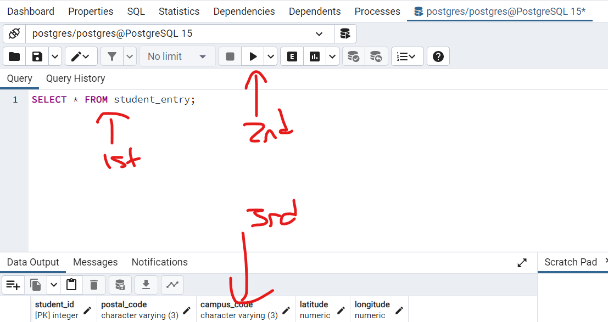

<h1 class="c6 c16" id="h.iou3n6t8k5bz">8.0 Heatmaps v2.ipynb</h1>

<h2 id="h.3f345gg45yht" class="c6">8.1 Upload Notebook</h2>

First you have to use . The link is . Upload and open the &ldquo;Generate_Maps.ipynb&rdquo;notebook. 

 
 <h2 class="c6 c16" id="h.i0ritiqm0h8p">8.2 Running the Notebook</h2>
 
After you have the notebook uploaded to &nbsp;you can now run the code. Click the run button in the left hand corner. See example below:

You also have to upload the coordinates generated in <a class="c3" href="#h.r223hc1t2jao">Step 6.0</a>, copy and paste the latitude and longitude from the sheet name label &ldquo;lat_long_heatmap&rdquo; into a new excel file and upload this file to . See example below:

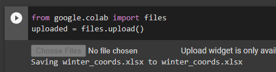

You also need to change the api key to the one you got in <a class="c3" href="#h.yojc0vkseelo">Step 3.0</a>. See example below:

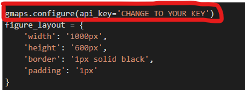

You also need to change the api key again to the one you got in <a class="c3" href="#h.yojc0vkseelo">Step 3.0</a>. And get the coordinates to the top 10 commute origins via a Google Search. See example below:

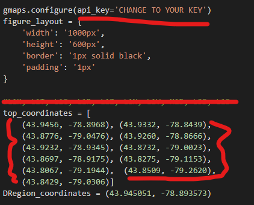

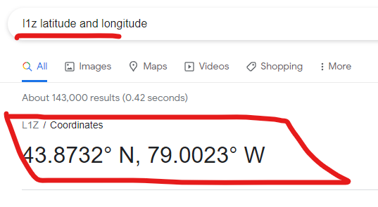
<h1 class="c6 c16" id="h.h0unzue9h6sr">9.0 Create Graphs</h1>
This last step requires you to have a Master&#39;s Degree in Excelonomics. Open your generated .xlsx files generated in step 6.0 and create the graphs you seek. For example (Average Distance vs Average Commute Time):

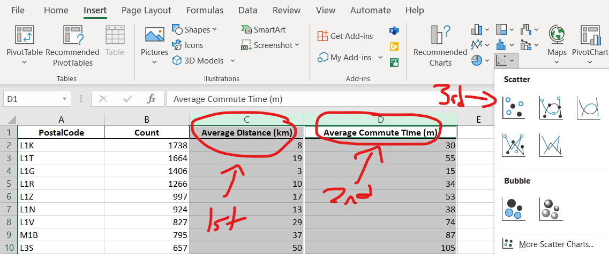

Output:

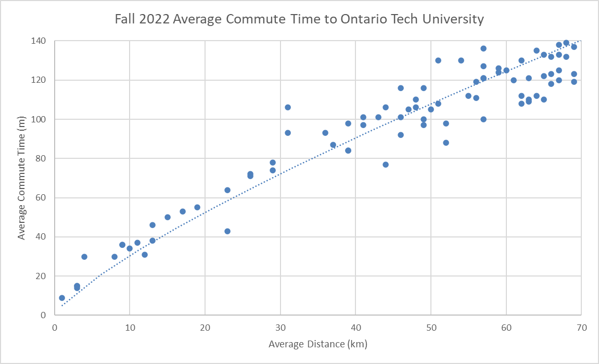

</body>
